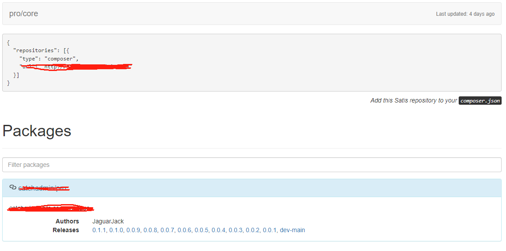

# 使用 Satis 搭建属于自己的私有仓库

而在某些情况下，我们可能希望将自己的 PHP 包保存在一个私有仓库中，以便更好地管理、分享和维护项目的依赖项。

`Satis` 是一款强大的工具，它让你能够轻松地搭建属于自己的 `Composer` 仓库，无论是为了内部使用、团队协作，还是出于其他安全和隐私的考虑。本文将向您介绍如何使用 `Satis`，一步步地构建一个私有仓库。

社区好像也没有关于如何出售自己的私有仓库的文章。文章最后将会介绍如何将私有仓库接入到项目的认证系统，并授权给用户使用，这是一个很好的方式，当然这种方法不会对源码进行保护。但也比源码直接泄露出去强很多了。
[[toc]]

## 创建项目

首先创建一个空的 satis 项目,主要按照相关依赖，里面只包含一个 vendor 目录

```shell
mkdir private

cd privite

composer require "composer/satis:*" --ignore-platform-reqs --with-all-dependencies
```

依赖安装完成之后，查看下目录结构。大概就是以下几个文件

```shell
|--- composer.json
|--- composer.lock
|--- vendor/
```

## 配置 satis.json

```json
{
  "name": "private/package", // 随便起个名称
  "homepage": "http://satic.xxxxx.com/", // 私有仓库域名
  "output-dir": "dist", // 输出目录
  "repositories": [
    // 配置包的 vcs 地址
    {
      "type": "vcs",
      "url": "https://git.xxxxxx.com/satis/package" // 这里设置私有仓库地址，记得
    }
  ],
  "archive": {
    "directory": "dist", // 包的存储目录
    "skip-dev": false
  },
  "require-all": true
}
```

配置好了 `satis.json` 之后，就可以使用下面的命令

```bash
php vendor/bin/satis build
```

执行之后，你将会看到以下输出。

```shell
scanning packages
...
```

这个命令会扫描配置版本控制系统的地址，并且把所有的对应仓库版本打包下载到 `dist` 目录。

如果你执行到了这一步，那么你应该会看到 `dist` 目录下面的 `dist/`

配置 `nginx` 来访问项目。假设这里你配置的域名`http://satic.xxxxx.com/`，步骤这里就省略了。在配置完成之后。访问 `http://satic.xxxxx.com/index.html`的时候，会看到这样的页面，说明你已经成功配置了。


虽然已经完成了私有仓库的配置，也看到了私有包被下载下来了，但这里还需要在 composer.json 中配置一下，才可以通过 `composer` 来下载。打开项目的 `composer.json`，加上下面的配置

```json
"repositories": [
      {
    	"type": "composer",
    	"url": "http://satic.xxxxx.com/" // 设置仓库，就是 satis 的 homepage
      }
   ]
```

使用 composer 下载

```bash
composer require satis/package // 这里注意下，名称使用你的私有包的里面 composer.json 的 name
```

可以看到 `satis/package` 包被下载了下来。这样就完成了私有仓库的搭建。

## 部署

在做私有库之前先部署一下，目前我使用 `github action` 进行部署的。因为 Satis 使用的是私有仓库，所以呢，当执行下面的命令的时候

```bash
php vendor/bin/satis build
```

需要对私有仓库授权，才可以从 vcs 拉取代码。所以如果使用 Github Action 需要手动输入账户密码。看下面的注释

```bash
name: 私有仓库构建
on:
  push:
    branches:
      - master
jobs:
  deploy:
    runs-on: ubuntu-latest

    steps:
      # checkout master 分支
      - name: Checkout
        uses: actions/checkout@master

      # 设置 PHP
      - name: Setup PHP with PECL extension
        uses: shivammathur/setup-php@v2
        with:
          php-version: '7.4'
          tools: composer:v2

      # 模拟输入输出
      - name: Install expect
        run: sudo apt-get install -y expect

      # 安装 composer 依赖
      - name: 安装 composer 依赖
        run: |
          composer install
          echo "打包私有库"
          expect -c "
          spawn php vendor/bin/satis build
          expect \"Username:\"
          send \"${{ secrets.GITEE_USERNAME }}\r\" // username 我使用的 GITEE
          expect \"Password:\"
          send \"${{ secrets.GITEE_PASSWORD }}\r\" // password 我使用的 GITEE
          expect -re \".*auth.*\"
          send \"Y\r\"
          expect eof
          "
      - name: 部署私有库
        uses: easingthemes/ssh-deploy@v5.0.0
        with:
          REMOTE_HOST: ${{ secrets.SERVER_HOST }}
          REMOTE_USER: ${{ secrets.SERVER_USERNAME }}
          SSH_PRIVATE_KEY: ${{ secrets.SERVER_SECRET }}
          ARGS: -rlgoDzc -i --delete
          SOURCE: 'dist/'
          REMOTE_PORT: ${{ secrets.SERVER_PORT }}
          TARGET: ${{ secrets.SERVER_WORKDIR }}
```

当然我是做了自动部署，你也可以直接上传。使用 nginx 配置
:::info
这里如果配置 ssl，发现都无法使用 composer 拉取。如果使用 https，每个用户都需要在本地配置 ssl 证书，所以干脆直接就不用了 😂
:::

```shell
server
{
    listen 80;
    server_name satis.catchadmin.com;
    index index.html index.php index.htm default.php default.htm default.html;
    root /var/www/html/satis; // 配置 root path

    access_log  /var/log/nginx/satis.log;
    error_log  /var/log/nginx/satis.log;
}
```

可以直接当做静态项目访问就可以了

## 私有库认证

上面的还不够私有，一旦被别人发现配置，任何人都可以下载这个包。所以还需要接入一个认证系统。

在接入之前，你可以通过下面的命令来获取包的时候，就可以看到整个包的下载过程

```bash
composer require satis/package -vvv
```

你会发现，整个包的过程是不经过框架的，都是直接访问 `dist/` 下面的文件，这说明什么呢？说明这个项目有两种访问方式。

- 经过 `index.php`
- 不经过 `index.php` 直接访问 `dist` 下面的 `zip` 资源。

但是这两种方式都是通过 `nginx` 来访问的。如果在 `nginx` 上设置访问权限的话，是不是就可以了？简单的认证可以通过 `http.basic`，这也是 `satis` 推荐的认证方法。你可以在 `nginx` 设置如下配置

```shell
location /
{
    auth_basic "输入用户名密码";
    auth_basic_user_file conf.d/authfile; // 认证文件地址
    autoindex on;
}
```

`authfile` 里面可以配置用户密码，格式如下，一行一个

```json
username:pwd
```

重启 `nginx` 之后，再试一次，再次尝试下载就需要输入用户名密码，才可以继续了。似乎已经完成了目标。必须认证通过才可以继续访问。但是这里会出现另外一个问题。

每次有新用户使用私有库的包，都要去修改 `conf.d/authfile` 配置吗？并且每次都需要重启 nginx。这样是不是很麻烦。如果不用 `nginx` 的 http.basic 这种特别费劳动力的方法，如何解决这个问题？

可以换一种方式思考这个问题。前提是要能接入自定义的认证系统。在这个前提下问题就变成了在访问 `dist` 目录下资源的时候，需要发送一次请求给认证系统，在认证系统通过之后就可以继续访问包资源。这样就很容易理解了，解决这个问题需要新认识 `nginx` 的一个指令。

### auth_request

高版本的 nginx 是内置这个指令的，如果是低版本，则需要编译 `nginx-auth-request-module` 模块。

`auth_request` 指令的作用就是在访问资源的时候、发送一次子请求至认证系统，如果认证系统返回 **2xx** 的状态码，那么就可以继续访问资源的请求，如果返回 **401** 状态，则中断访问。

这个指令就完全符合这个需求。配置如下

```shell
location /dist {
    auth_request /auth;
}

location /auth {
    internal;
    proxy_method      POST;
    proxy_set_header  Accept "application/json";
    proxy_set_header  X-Original-URI $request_uri;
    proxy_pass        https://xxxx.com/satis/auth; // 授权地址
}
```

看第一个 `location` 配置，访问 `dist` 目录时，通过 `auth_request` 发送一个子请求到认证系统的 `/auth` 下。

接着看第三个 `location`，不光请求接口，还将原请求的地址通过 `X-Original-URI` 一并发送给了接口，原请求地址就是 `composer` 包的地址。通过包地址可以知道一些包的信息，例如包名，版本号之类的。系统从这些信息中，当前判断用户是否有访问包的权限。

到这里还是会有疑问 🤔️。那用户的用户名和密码呢？从哪里获取呢。不急，先写好系统的认证接口。从认证接口里，将会知道一切！这里使用 Laravel，其他任何框架都是一样的

- 先创建认证控制

```bash
php artisan make:controller AuthController
```

- 创建路由

```bash
cd routes

vim web.php

Route::post('/api/satis/authenticate', [\App\Http\Controllers\AuthController::class, 'index']);
```

:::tip
由于 `Laravel` 会自带 `CSRF`，所以先关闭 `CSRF`，不然请求将会被拦截。
:::

- 认证代码

```php

namespace App\Http\Controllers;

use Illuminate\Http\Request;
use Illuminate\Support\Facades\Log;

class AuthController extends Controller
{
    //
    public function index(Request $request)
    {
        // Log::info(json_encode($request->header()));

        $username = $request->header('php-auth-user');

        $pwd = $request->header('php-auth-pw');

				// $token = explode(' ', $request->header('authorization'))[1];
        // [$username, $pwd] = explode(':', base64_decode($token));

        $res = $username === 'xxx' && $pwd === 'xxxx';

        abort_unless($res, 401, 'Auth Failed');

        return response('Auth Successful', 200);
    }

}
```

- 认证信息是通过 `header` 获取
- 可以通过 **header** 的 `php-auth-user` 和 `php-auth-pw` 获取用户名密码
- 也可以 **header** 的 **authorization** 获取，token 其实就是 `username:pwd` 字符 `base64` 之后的结果
- 最后通过 `username` 和 `pwd` 来认证

上面的结果只是一个非常简单的示例，需要更加完成的私有仓库方案，还需要完善其他的一些功能。目前想到的有

- 提供添加仓库的功能
- 自动获取私有包
- 提供购买私有包的功能
- .....
